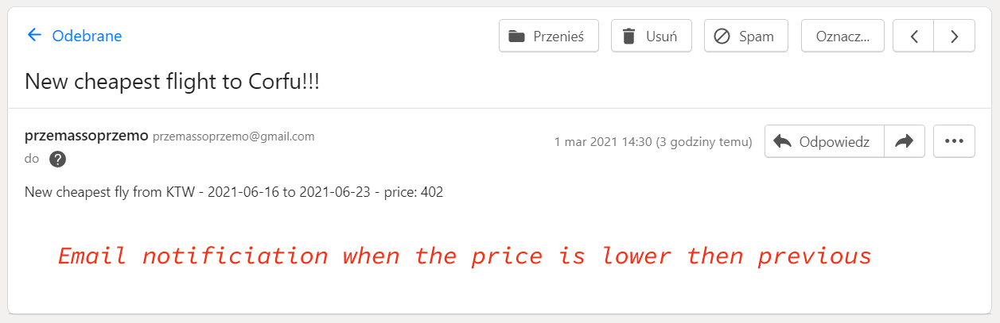

# CFU flight search
This App searches for the cheapest flights to Corfu from Warsaw, Poznan and Katowice, closest cities to my home, from the next day to 6 months ahead. And then saves this flights to google sheet, and if the price of any flight is lower than previous cheapest price, it send me email notificiation.

## Table of contents
* [Colors key](#colors-key)
* [General info](#general-info)
* [Screenshots](#screenshots)
* [Technologies](#technologies)
* [Features](#features)
* [Inspiration](#inspiration)
* [Contact](#contact)

## Colors-key

## General info
This project based on challenge from Python course by Angela Yu - "100 day of code". I changed some things like for example there is no list of destinations in google sheet, but there is only one (my favourite:) ) destination - Corfu. And I decided to put all nearest airports to the list, and search all flights from these places. App sends searchnig outcome to google sheet and the cheapest flights from these airports saves in csv file (that's the next difrence between course project and my app) and when one of these flight has the lower price then price in this file, app send notification to me by email (in course project - by sms).
## Screenshots

## Technologies
* Python 3.9
* Sheety API
* Tequila API

## Features

To-do list:
* set searching for every next month, not half a year

## Status
Project is: _finished

## Inspiration
Python course "100 days of Code" by Angela Yu
## Contact
Created by [przemoszadkowski@o2.pl](mailto:user@example.com) - feel free to contact me!